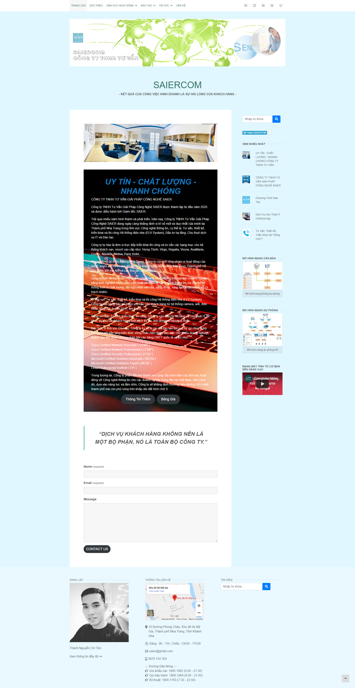
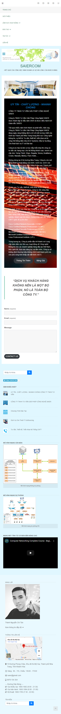
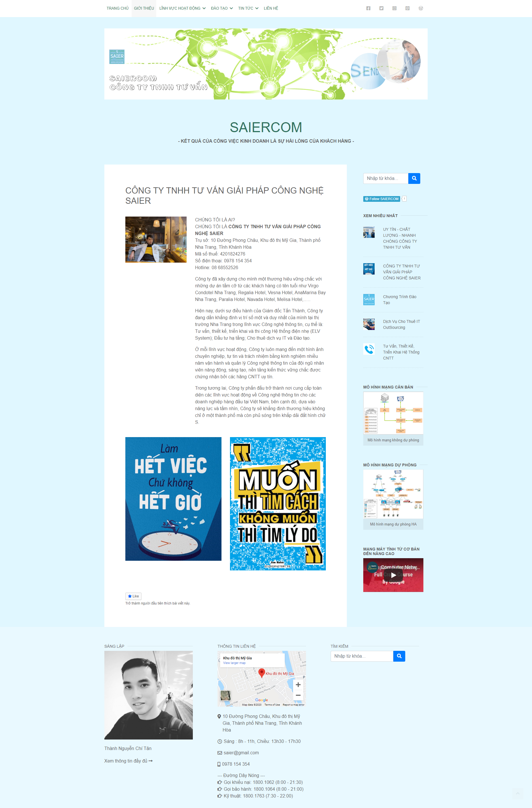
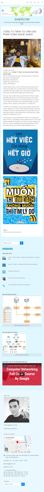
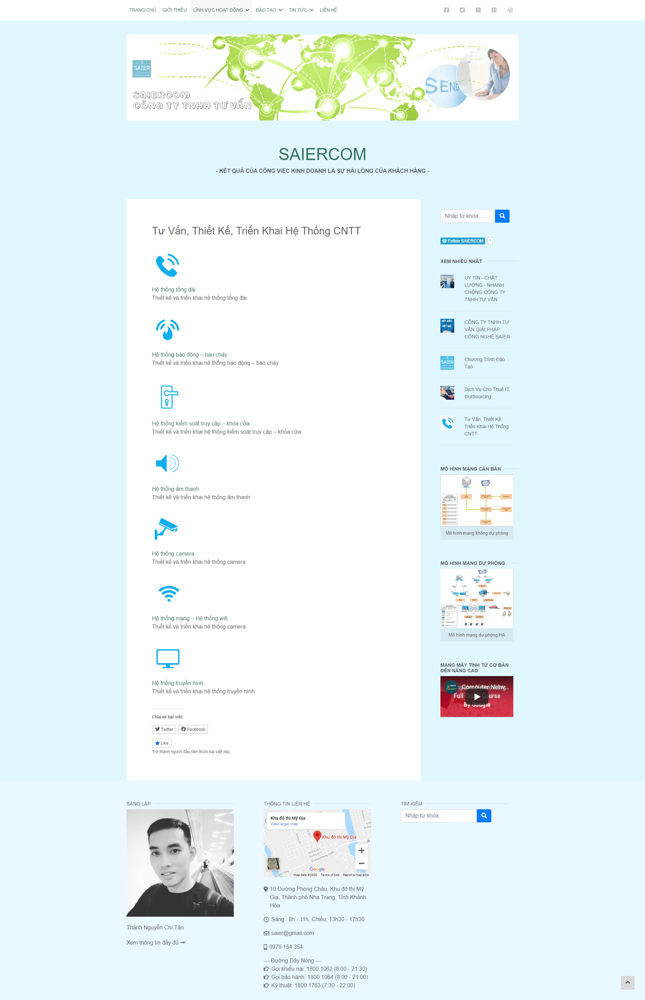
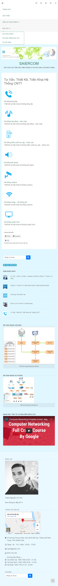

# Thi_KTM_Web
1. Họ và Tên: Nguyễn Chí Tấn Thành
2. Lớp: CTT13CD3A
3. Thi kết thúc môn: Thiết kế và quản trị Website. Thời gian: 23/12/2020
4. Địa chỉ Web: up local (Web thể hiện giống trang Wordpress, có Reponsive, có Sidebar, Menu sổ xuống, footer..v...v..)
5. Địa chỉ Wordpress: https://saiercom.wordpress.com/

---MỘT SỐ TRANG CHỤP WEBSITE HTML,CSS,JS---
## index.html

## about.html

## linhvuchoatdong.html

